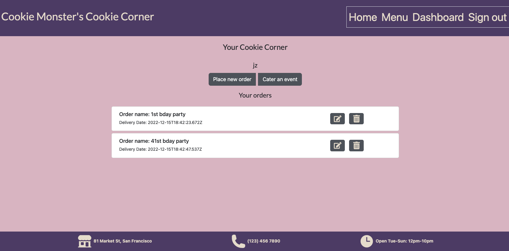
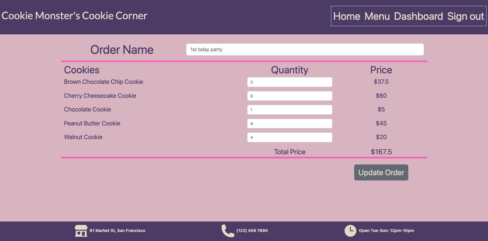
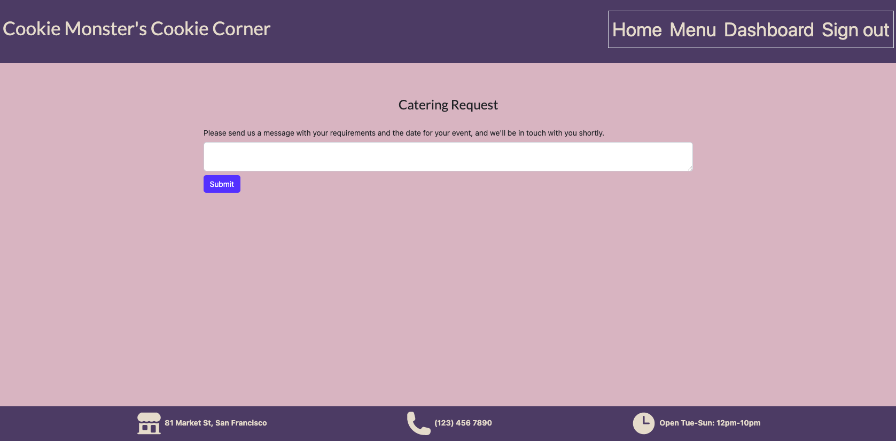

# Cookie Corner

## Description

Cookie Monster’s Cookie Corner is a dynamic and reactive webpage so that anyone can purchase the most delicious fictitious cookies on the planet.  The purpose of this project was to utilize our skills with M.E.R.N. technologies to build a full stack website.  Upon exploration you will notice we have an entire back end that serves up data from MongoDB and a single page dynamic front end that renders data on react components to the client. 

## Deployed Link & Preview

Here is the link to the [deployed application](https://cmcookiecorner.herokuapp.com/)


## Why?

We wanted to create dynamic and easy to use webpage for small business accessibility.  It can be extremely pricy for businesses to have a fully functioning website where they can advertise and sell their products.  Cookie Corner allows the cookie monster's secret recipe to be sold all over the world with a simple click. 

### Features

- View the menu of cookies.
- Login and create a user with the ability to create an order.
- Be able to add as many cookies as you want to your order.
- Be able to update/delete orders as desired.
- Be able to request a catering for your work or child's birthday party.

## Table of Contents

- [Installation](#installation)
- [Usage](#usage)
- [Technologies Used](#technologies-used)
- [Models and Relationships](#models-and-relationships)
- [API Routes](#api-routes)
- [User Stories](#user-stories)
- [Credits](#credits)
- [Collaborators](#collaborators)
- [License](#license)

## Installation
If using the active link, no installation required.
If developing:
- Create a new repository on your GitHub account.
- Clone this repository.
- Run `npm install`
- Run `npm run seed`
- Run `npm run develop` in root

## Usage

Using the command line the user should first run an "npm i" to download all dependencies for this application.  Npm run seed, will ensure you get the most out of the application by allowing the user to view the cookie menu and prices associated with them.  To start the application the user should run "npm run develop" which will concurrently npm start the server and the React ports.  

## Technologies Used

#### Front-end
- HTML / CSS
- Javascript
- React.js
- React-Bootstrap
- React Router
- React Icons
- Sweet Alert
- EmailJS

#### Back-end
- Node.js
- Express.js
- JSON Web Token
- bcrypt
- MongoDB
- Mongoose

## Models and Relationships
As you can see from the code snippets below, the relationships we chose to initiate is users have orders(with the option to populate order data) and orders have food/cookies(with the option to populate order data).  This put the orders as the essential pivot point of the back end code.
```Javascript
const userSchema = new Schema({
  fullName: {
    type: String,
    required: true,
    trim: true,
  },
  email: {
    type: String,
    required: true,
    unique: true,
    match: /.+@.+\..+/,
  },
  password: {
    type: String,
    required: true,
    minLength: 8,
  },
  orders: [
    {
      type: Schema.Types.ObjectId,
      ref: 'order',
    }
  ],
});
const orderSchema = new Schema(
    {
        orderName: {
            type: String,
            required: true,
            trimmed: true,
        },
        createdAt: {
            type: Date,
            default: Date.now,
        },
        deliveryDate: {
            type: Date,
            default: Date.now,
        },
        food: [
            {
                foodId: {
                    type: Schema.Types.ObjectId,
                    ref: "food",
                },
                quantity: {
                    type: Number
                }
            },
            
        ],})
        const foodSchema = new Schema({
    name: {
        type: String,
        required: true,
    },
    price: {
        type: Number,
        required: true,
    },
    ingredients: {
        type: String,
        required: true,
    },
    picture: {
        type: String
    }
});
```

## API Routes

#### User
POST /api/users           Create a user on signup \
GET /api/users/me         Get the currently logged in user with orders\
POST /api/users/login     Log the user in\
POST /api/users/logout    Log the user out\
            
```Javascript
getMe: async (req, res) => {
      console.log("in getMe");
      try {
        console.log("user._id:" + req.user._id);
        const user = await User.findOne({_id: req.user._id}).populate('orders');
        user? res.json(user):
          res.status(500).json({message: 'Error finding user'});
        return;
      } catch(err) {
        res.json(err);
      }
    },
```

#### Order

GET   /api/order            Get all orders\
GET   /api/order/:orderId   Get a single order by id\
POST  /api/order            Create an order\
PUT   /api/order/:orderId   Update order details\
DELETE /api/order/:orderId  Delete an order
                            
```Javascript
async createOrder(req, res){
        try {
            console.log('in createOrder');

            const newOrder = await Order.create(req.body);
            console.log('created order', JSON.stringify(newOrder));

            const updatedUser = await User.findOneAndUpdate(
              { _id: req.user._id },
              { $addToSet: { orders: newOrder._id } },
              { new: true, runValidators: true }
            );
            console.log('updatedUser' + JSON.stringify(updatedUser));
            return res.json(newOrder);
          } catch (err) {
            console.log(err);
            return res.status(400).json(err);
          }
    },
```

#### Food
GET /api/food               Get all the food items
GET /api/food/:foodId       Get one food item by id          

```Javascript
async getAllFood(req, res) {
        const allFood = await Food.find();

        if (!allFood) {
            return res.status(400).json({ message: 'There are no cookies' })
        }
        res.status(200).json(allFood);
    },

    async getSingleFood(req, res) {
        try {
            const food = await Food.findOne({ _id: req.params.foodId });
            food ?
                res.json(food) :
                res.status(400).json({ message: 'No food found' });
            return;
        } catch (err) {
            res.json(err);
        }
    },
```
## User Stories
I want to see information about the restaurant,

To see the menu of items the restaurant offers,

To view all orders I have created, To place an order, To delete my order,

To change my order, Add cookies to my order,

To send a message if I have a special request


## Credits

[EmailJS](https://www.emailjs.com/docs/)

[SweetAlert2](https://sweetalert2.github.io/)

## Collaborators

- William Seban [GitHub Profile](https://github.com/wseban)
- Nichole Guan [GitHub Profile](https://github.com/ncguan)
- Priya Bhikshesvaran [GitHub Profile](https://github.com/sbhikshe)
- Mehmet Musabeyoğlu [GitHub Profile](https://github.com/MehmetMusabeyoglu)

## License

This project is licensed under the [MIT](./LICENSE) license.
